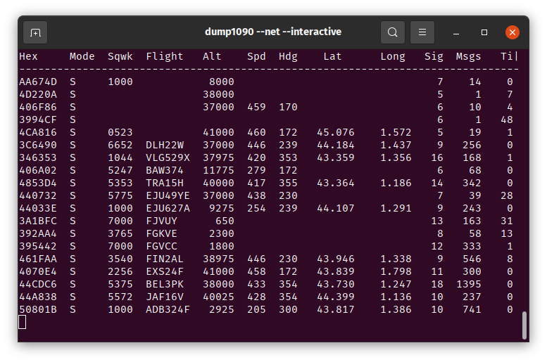

La capture de données ADS-B se fait en deux temps:

- un logiciel nommé `dump1090` (en référence à la fréquence 1090MHz qui porte les signaux ADS-B) décode les signaux reçus par l'antenne;



- un outil en ligne de commande qui exploite les données en temps (et qui écrit notamment les signaux reçus dans un fichier à part);

Un fichier CSV est produit dans votre dossier utilisateur. Nous le redécoderons par la suite.

## Installation de `dump1090`

L'outil `dump1090` décode les signaux reçus par l'antenne, via le dongle USB et les affiche dans le terminal.

| Système d'exploitation | Commandes                                           |
| ---------------------- | --------------------------------------------------- |
| Linux                  | `sudo apt install librtlsdr-dev`                    |
|                        | `git clone https://github.com/MalcolmRobb/dump1090` |
|                        | `cd dump1090`                                       |
|                        | `make`                                              |
| MacOS                  | Extraire l'archive dans le dossier `extra/dump1090` |
| Windows                | Extraire l'archive dans le dossier `extra/dump1090` |
|                        | Installer les drivers avec Zadig                    |

## Vérification de la bonne marche de `dump1090`

Si tout se passe bien, en lançant `dump1090`, voici le type d'affichage que vous devriez voir:

```zsh
➜ dump1090
Found 1 device(s):
0: Realtek, RTL2838UHIDIR, SN: 00000001 (currently selected)
Detached kernel driver
Found Rafael Micro R820T tuner
Max available gain is: 49.60
Setting gain to: 49.60
Exact sample rate is: 2000000.052982 Hz
Gain reported by device: 49.60
Allocating 16 zero-copy buffers
*8d395d67585104bbe648648c7e36;
CRC: 000000 (ok)
DF 17: ADS-B message.
  Capability     : 5 (Level 2+3+4 (DF0,4,5,11,20,21,24,code7 - is airborne))
  ICAO Address   : 395d67
  Extended Squitter  Type: 11
  Extended Squitter  Sub : 0
  Extended Squitter  Name: Airborne Position (Baro Altitude)
    F flag   : odd
    T flag   : non-UTC
    Altitude : 15000 feet
    Latitude : 24051 (not decoded)
    Longitude: 18532 (not decoded)
...
```

- Si vous ne branchez pas d'antenne sur votre port USB, vous verrez l'erreur suivante:

```zsh
➜ dump1090
No supported RTLSDR devices found.
[1]    218752 exit 1     dump1090
```

- Si malgré l'antenne branchée, il ne se passe toujours rien, il faut peut-être ajouter l'option suivante:

```zsh
➜ dump1090 --device-index 1
```

## Lancement de l'application

1. Dans un premier terminal, entrer la commande:

   ```zsh
   ➜ dump1090 --net --interactive
   ```

   Ajouter l'option si nécessaire:

   ```zsh
   ➜ dump1090 --net --interactive --device-index 1
   ```

2. Dans un autre terminal (Anaconda Prompt sous Windows), activez l'environnement puis ouvrer l'interface graphique:

   ```zsh
   ➜ source activate pyclass
   ➜ traffic decode -r LFPO dump1090 --tui
   ```

[Next »](adsb.md)
