## L'essentiel

- La rotondité de la Terre est connue depuis l'Antiquité ;

- Ératosthène (200 av. J.-C.) mesurait le rayon de la Terre ;

- Les armées réclament des cartes de précision ;  
  Les scientifiques ambitionnent des mesures de précision.

- Utiliser Python pour calculer le rayon de la Terre à partir des mesures des Cassini (XVIIIe siècle).

# Historique de la cartographie

## Eratosthène de Cyrène

De nombreuses approximations, mais une première mesure !

## Claude Ptolémée

- Travaux dans la continuité de Ératosthène et Hipparque ;
- _Manuel de géographie_ (_Geographike Hyphegesis_, 150)
- Carte de l'écoumène (le monde habité) basée sur une grille de méridiens et de parallèles ;
- Deux projections coniques pour retranscrire les cartes ;

Il n'y a pas de trace de ses cartes aujourd'hui ; on retrouve des retranscriptions du XIe siècle à partir de ses descriptions.

## Le monde arabe

- En Europe, la dictature théologique annihile les découvertes grecques ;
- La _Géographie_ de Ptolémée sert de modèle aux traités arabes (période des _Abassides_, dès le VIIe siècle) ;
- **Al-Idrīsī** (XIIe siècle) centre sa perception du monde sur la Méditerranée : l'Empire Byzantin, le Monde islamique, Occident chrétien ;

  - _Livre du divertissement de celui qui désire découvrir le monde_ (_Kitāb nuzhat al-mushtāq fī ikhtirāq al-āfāq_) ;
  - Une exploration du monde qui présente de manière codifiée pays, villes, routes, frontières, mers, fleuves et montagnes ;
  - Informations de nature géographiques, économiques, commerciales, historiques et religieuses.

## La cartographie marine

- XIIIe siècle : croissance du commerce maritime ;
- Les _portulans_ : cartographie des côtes et des ports, avec îles, abris et amers ;
- Roses des vents, lignes de rhumbs (angles de route) ;
- Cartes basées sur le Nord magnétique (boussole), et plus sur le Nord géographique (étoile polaire) ;
- XVe siècle : découverte du Cap de Bonne-Espérance, découverte de l'Amérique ; essor de la cartographie.

## La triangulation

- Une mesure des distances basée sur la loi des sinus;

$$\frac{a}{\sin \alpha} = \frac{b}{\sin \beta} =\frac{c}{\sin \gamma}$$

- À partir de la mesure d'une base et de deux angles, on calcule les distances correspondantes.

- Première triangulation par Snell pour la mesure d'un arc de méridien entre Alkmaar et Berg op Zoom (1614)

## La triangulation

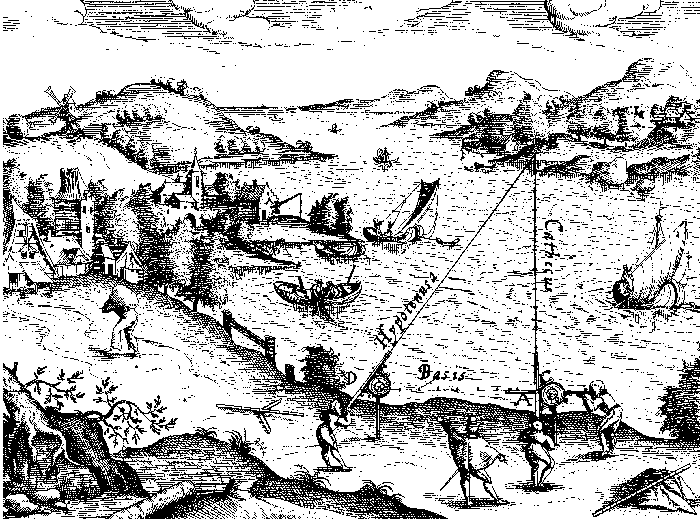

## Inō Tadataka (1745 -- 1818)

1800 : Le shogun autorise Inō a réaliser une carte du pays avec son propre argent.

1818 : Mort de Inō Tadataka.  
Sa carte du Japon (échelle $1:216 000$) est alors inachevée.

3 736 jours de mesure, 34 913 kilomètres parcourus

Le _Tadataka-zu_ (Les cartes de Tadataka), dont beaucoup sont précises à 1/1000e de degré, sont restées les cartes en usage au Japon jusqu'en 1924.

# La carte de France des Cassini

## Les grandes ambitions de Colbert

Jean-Baptiste Colbert (1619 -- 1683), ministre de Louis XIV

1666 : **Création de l'Académie des Sciences**

_« Faire des cartes géographiquement de la France plus exactes que celles qui y ont était faites »_ (1668)

1669 : 1re triangulation de Paris à Amiens par l'abbé Picard

1682 : Relevés de latitude et longitude des principales villes du littoral (Picard et La Hire)

_« Ces chers messieurs de l’Académie, avec leurs grands travaux m’ont coûté une partie de mon royaume et m’ont pris plus de territoire que tous mes ennemis réunis ! »_ (1682)

## Un grand projet de cartographie

1681 : Picard présente un projet de châssis géographique qui doit comporter une grande traverse triangulée qui irait de Dunkerque à Perpignan.

1682 : Mort de Picard.

_« Sa Majesté ordonne aux Mathématiciens de l'Académie des Sciences de continuer l'entreprise et de prolonger vers le Septentrion et vers le Midi jusques aux confins du Royaume, une ligne méridienne qui passât par le milieu de l'Observatoire de Paris. »_ (1683)

Le travail sera terminé en 1718.

## Quatre générations de Cassini

- **Giovanni Domenico Cassini** (Cassini Ier),  
  Université de Bologne

  - l'intensité de la pesanteur varie en fonction de la latitude ;
  - 1657 : méridienne dans la basilique San Petronio ;
  - 1665 : grande tache rouge de Jupiter ;
  - détermine la vitesse de rotation de Jupiter, Mars et Vénus ;
  - 1671, 1672, 1684 : quatre satellites de Jupiter ;
  - 1673 : mesure de la distance Terre--Soleil (parallaxe de Mars) ;
  - 1675 : division des anneaux de Saturne.

Reçu à l'Académie des Sciences en 1669

## La Terre n'est plus sphérique

Les théoriciens (Hooke, Newton, Huygens) prédisent une Terre aplatie aux pôles mais les mesures de Cassini semblent indiquer le contraire.

L'Académie des Sciences prépare deux missions à des latitudes très différentes :

- au Pérou (1735) : Godin, Bouguer, La Condamine, Jussieu ;
- en Laponie (1736) : Maupertuis, Clairaut, Celsius.

Le retour de l'expédition en Laponie (1737) confirme l'hypothèse d'une Terre aplatie aux pôles.

## La méridienne de Paris

1738 : Cassini III et La Caille entreprennent une nouvelle mesure de la méridienne de Paris en six bases (Dunkerque, Villers-Bretonneux, Montlhéry, Bourges, Rodez, Perpignan).

1744 : Le retour de l'expédition au Pérou permet de conclure à un aplatissement de l'ordre de 1/200.

1791 : Le mètre est la dix-millionième partie de la moitié de méridien terrestre.

1792--1798 : Nouvelle mesure de la méridienne, de Dunkerque à Montjuïc, par Delambre et Méchain

## Une nouvelle carte de France entièrement triangulée

\hfill
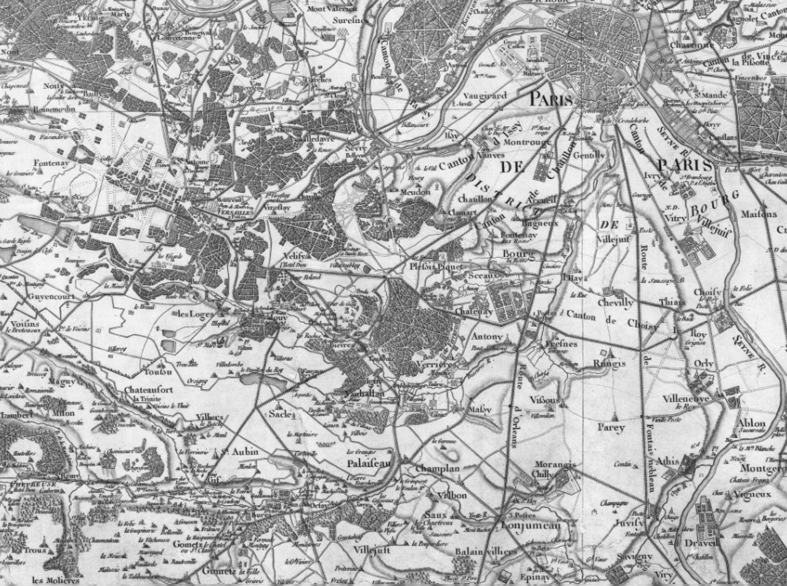
\hfill

# César-François Cassini de Thury

## La méridienne de l'Observatoire Royal de Paris

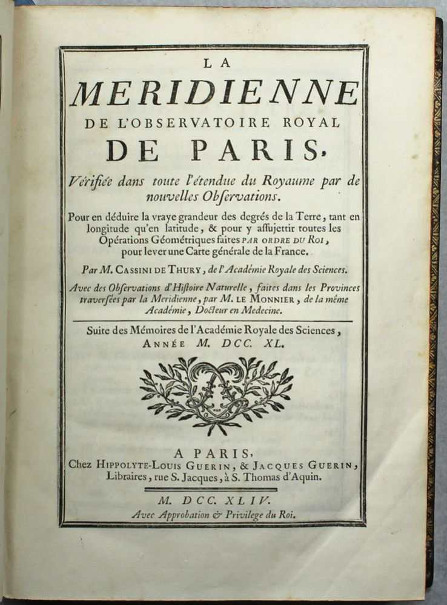
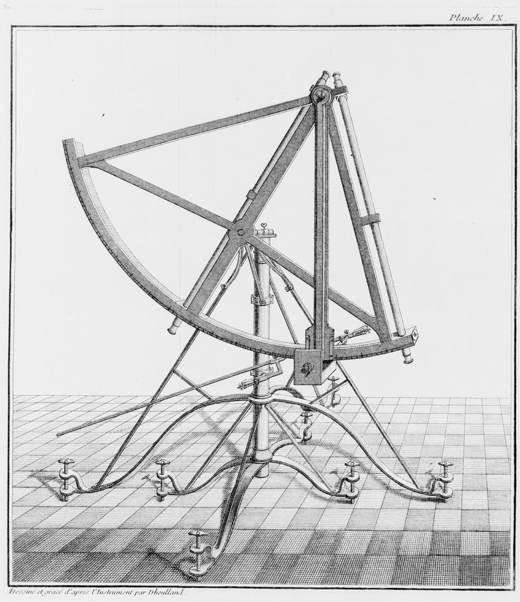

## Extraits des cartes: l'Observatoire de Paris

\hfill

\hfill

## Extraits des cartes: le Roussillon

\hfill
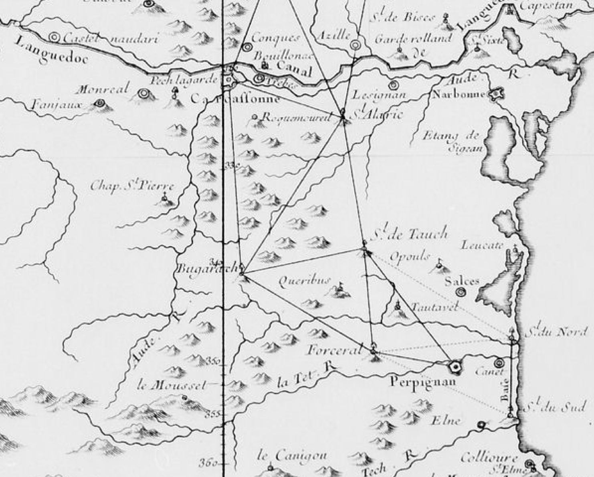
\hfill

## Les premières mesures

\hfill
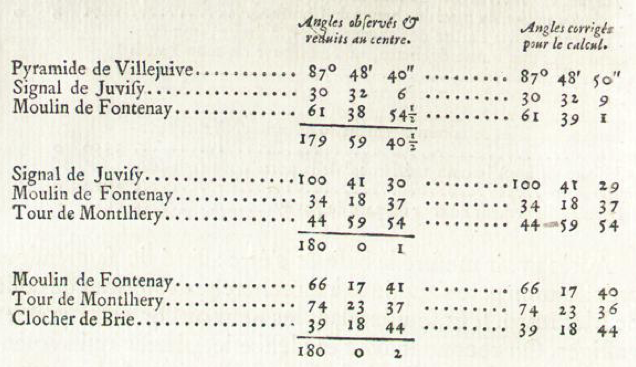
\hfill

## Les premières mesures

\hfill
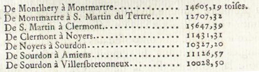
\hfill

\hfill
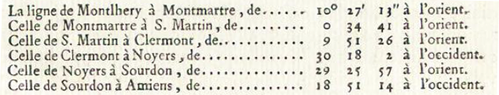
\hfill

## Les premières mesures

\hfill
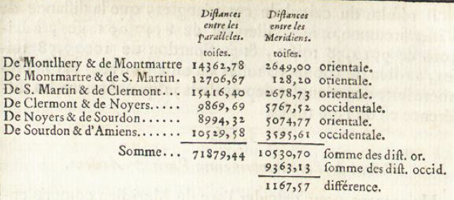
\hfill

## Les mesures de latitude

\hfill
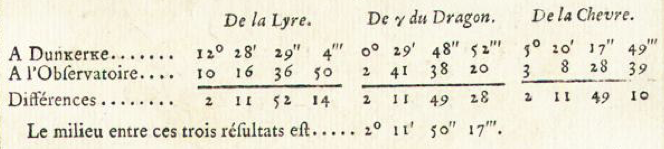
\hfill

\vspace{-1cm}

\hfill
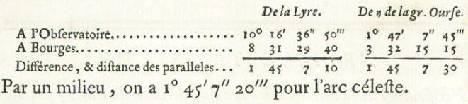
\hfill

## Les mesures de latitude

\hfill
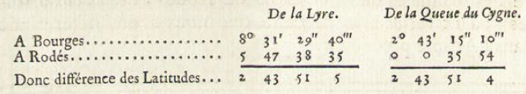
\hfill

\vspace{-1cm}

\hfill
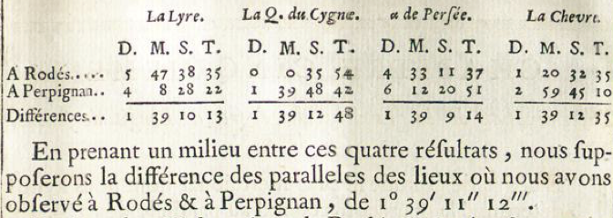
\hfill

# Données utiles

## Les unités de mesure

Conversions usuelles :

- 1 toise fait 6 pieds ;
- 1 pied fait 12 pouces ;
- 1 pouce fait 12 lignes

Échelle de la carte de Cassini :

- 1 ligne pour 100 toises ($1:86400$)

_1 toise du Châtelet fait 1,949 m_

## Les données d'entrée

Longueur de la ligne de base :

- de Villejuif à Juvisy : $5748$ toises ;
- dans le Roussillon : $7928$ toises et 5 pieds.

Les angles au sommet de tous les triangles sont recopiés dans le fichier `triangles.txt`.

Les inclinaisons par rapport à la méridienne de Paris sont recopiées dans le fichier `inclinaisons.txt`.
