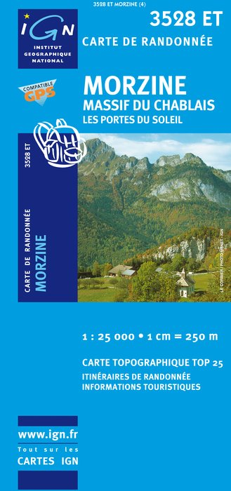
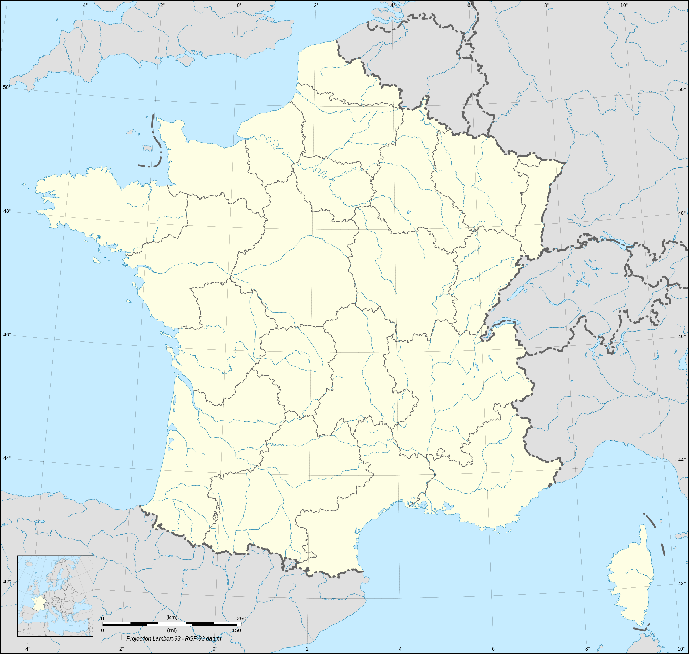
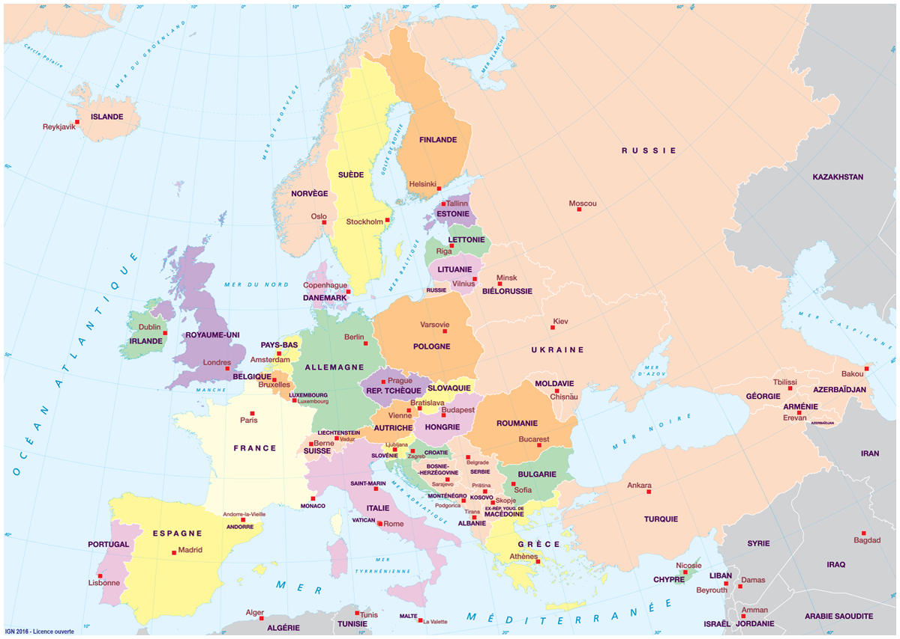
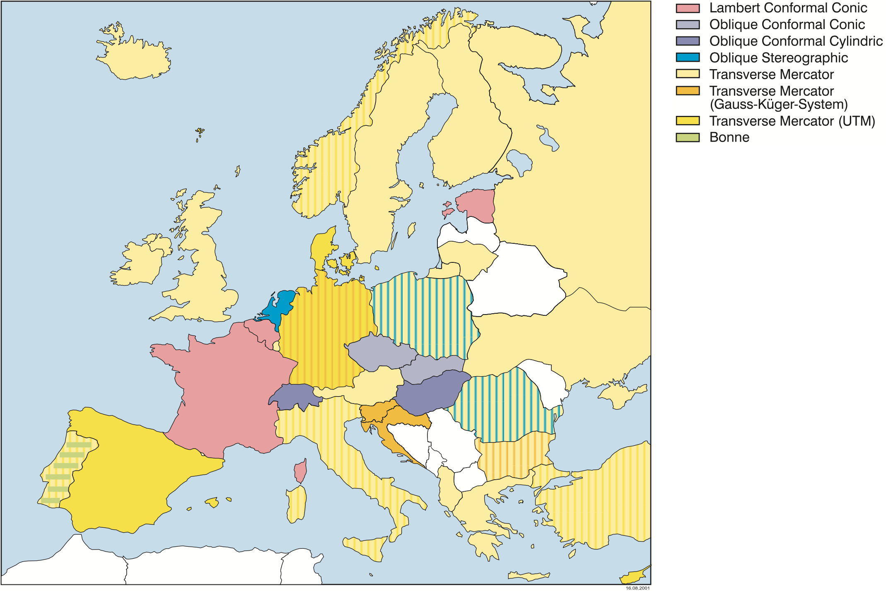
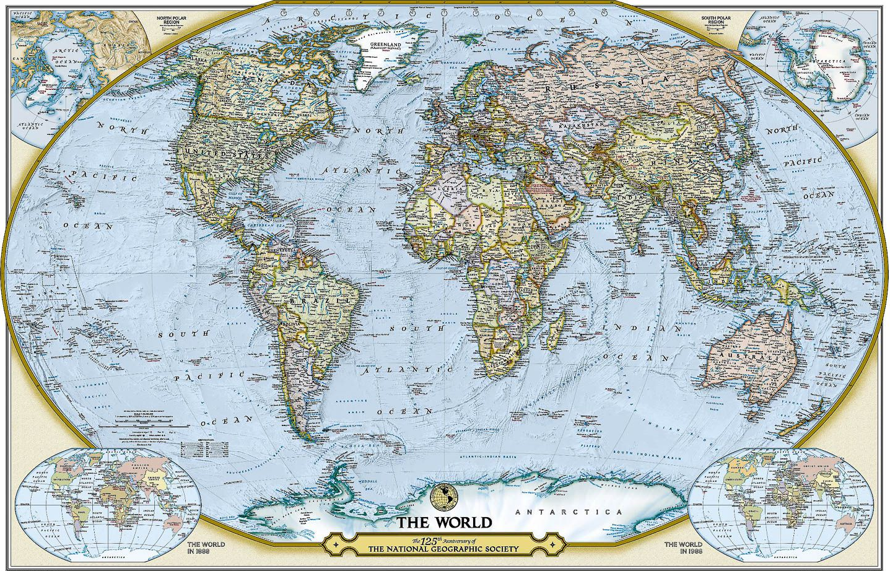
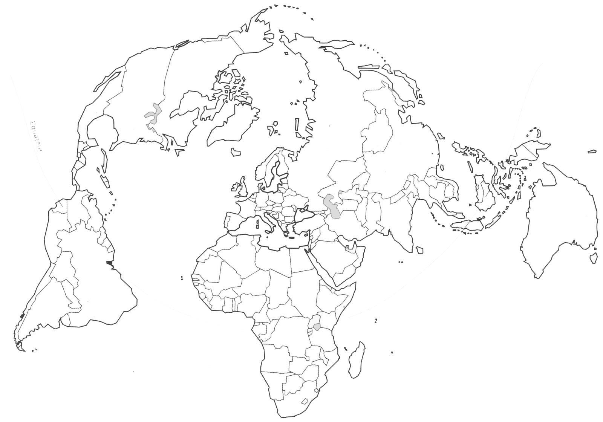
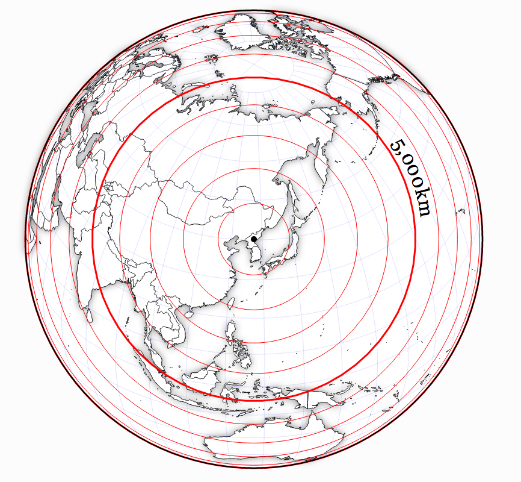

## The Blue Marble

{ height=80% }

# De la sphère au plan

## Projections azimutales

## Projections cylindriques

{ height=80% }

## Projections coniques

## Propriétés des projections

Deux propriétés mutuellement exclusives:

- les projections **conformes** conservent les distances;

- les projections **équivalentes** conservent les surfaces.

Beaucoup de projections sont des compromis qui ne conservent ni angles ni surfaces.

# Projections

## La projection de Mercator

- Une projection définie par Mercator au XVIe siècle
- La projection de référence pour la navigation:  
  _Les lignes de cap constant sont des lignes droites_
- De vrais problèmes de perception des tailles: [http://thetruesize.com](http://thetruesize.com)

## La projection de Mercator

## La projection conforme conique de Lambert

- Une des projections définies par J. H. Lambert (1772)
- Système adopté en France pendant la 1re guerre mondiale
- La **projection officielle dans plusieurs pays d'Europe**  
  notamment la France, la Belgique, l'Estonie, etc.
- La **projection de référence en aéronautique**  
  _Le plus court chemin entre deux points (grand cercle) est (localement) une ligne droite._

## La projection Lambert 93 à l'IGN

{ height=80% }

## Carte de France en Lambert 93

{ height=80% }

## Carte d'Europe en Lambert 93

{ height=80% }

## Projections standards dans les autres pays d'Europe

## La projection Winkel-Tripel

Projection construite afin de minimiser les distorsions de surface, de direction et de distance (cf. _tripel_)

- ni conforme, ni équivalente;
- aucune formule de passage inverse;
- adoptée par la National Geographic Society depuis 1998

## La projection Winkel-Tripel

## Projection de Bertin

## Projection orthographique

{ height=80% }

## http://xkcd.com/1799

## http://xkcd.com/1784

{ height=80% }
