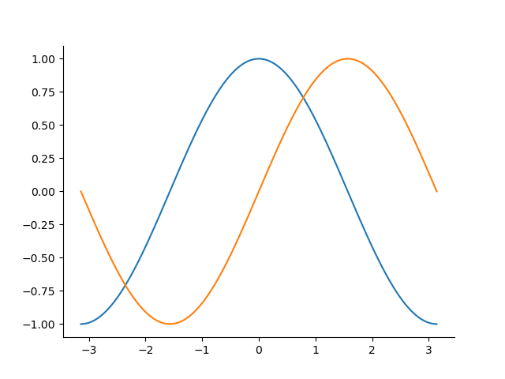
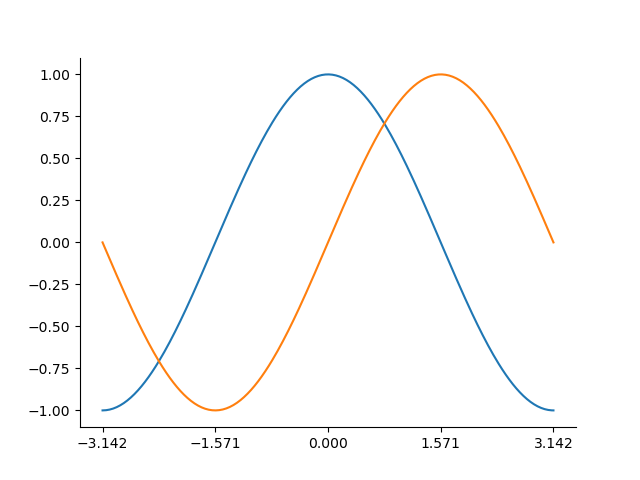
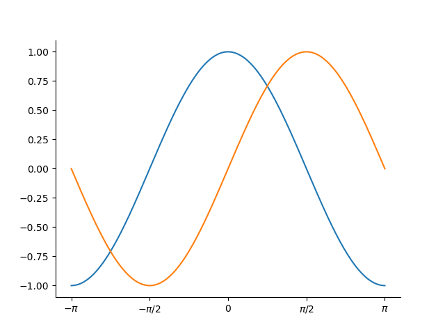
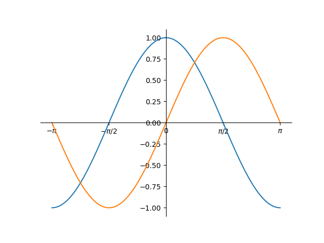
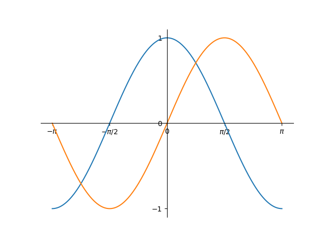
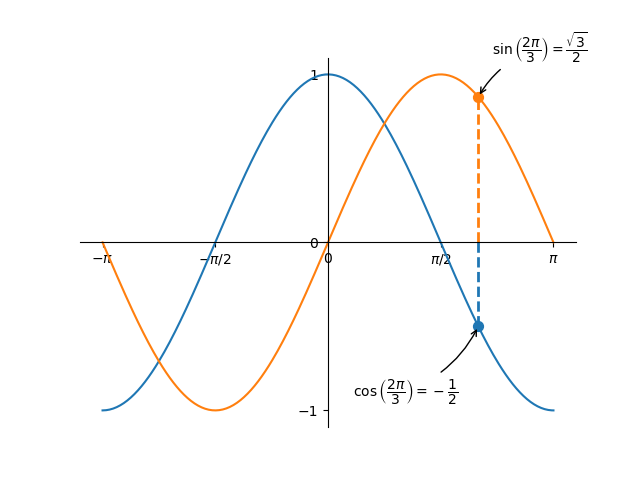
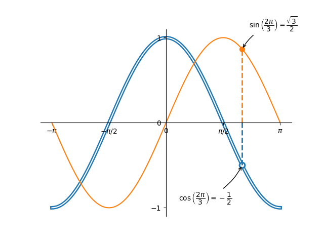
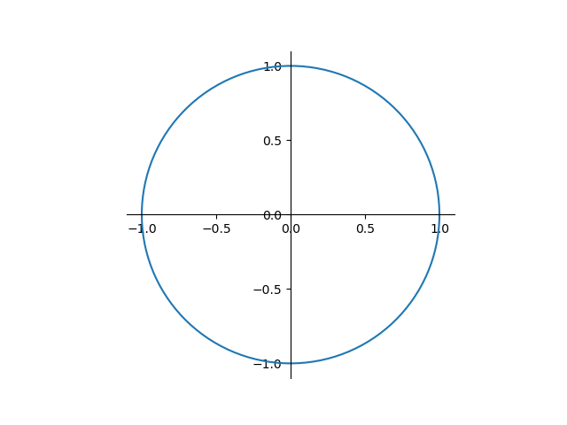

This session is based on a Python files. When you open this file with Visual Studio Code, you will notice pseudo-cells prefixed as follows:


Clicking on `Run Cell` (or pressing `Maj+Enter`) runs an IPython kernel appearing (usually) on the right side of your screen.

This approach is comfortable to preliminary projects:

- you can run, debug the code as a usual Python file, making your work _reproducible_;
- you can explore ideas with a notebook style, making your work _interactive_.

<div class="alert alert-success">
<b>Good practice</b> &nbsp;&nbsp; Consider this option before jumping to Jupyter notebooks when you start a new project. Notebooks are a natural choice for education materials, but they lack rigor in terms of software engineering and management.
</div>

The file is located in the `python/` folder:

- `matplotlib_demo.py`

## More exercices for Matplotlib

1. Trace the graph of function $t \mapsto e^{-t} \cdot \cos(2\,\pi\,t)$ for $t\in[0,5]$

2. Consider the polar coordinate curve defined by $r = \sin(5\,\theta)$, compute the x- and y- coordinates using Numpy functions, then plot the curve.

3. Start from the following code, and edit it through the followings steps to reach the final design:

   ```python

   import matplotlib.pyplot as plt
   import numpy as np

   x = np.linspace(-np.pi, np.pi, 256, endpoint=True)
   c, s = np.cos(x), np.sin(x)

   fig, ax = plt.subplots()
   (cos_plot,) = ax.plot(x, c)
   (sin_plot,) = ax.plot(x, s)

   ```

   - Remove the top and right spines
     

   - Set x-tick values for multiples of $\pi$
     

   - Set x labels with the $\pi$ symbol
     

   - Move the spines so that they cross at 0, 0
     

   - Adjust further the y-axis
     

   - Annotate some points
     

   - Try to imagine some trick to get the following rendering
     

4. Take lessons from Exercice 3 to produce the following plot:
   

[↑ Home](.) \| [Next >>](pandas)
