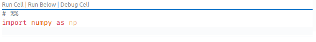

## Numpy and Matplotlib

This session is based on two Python files. When you open these files with Visual Studio Code, you will notice pseudo-cells prefixed as follows:

Clicking on `Run Cell` (or pressing `Maj+Enter`) runs an IPython kernel appearing (usually) on the right side of your screen.

This approach is comfortable to preliminary projects:

- you can run, debug the code as a usual Python file, making your work _reproducible_;
- you can explore ideas with a notebook style, making your work _interactive_.

<b>Good practice</b> &nbsp;&nbsp; Consider this option before jumping to Jupyter notebooks when you start a new project. Notebooks are a natural choice for education materials, but they lack rigor in terms of software engineering and management.

The two files are located in the `python/` folder:

- `numpy_demo.py`
- `matplotlib_demo.py`

[↑ Home](.) \| [Next >>](pandas)
