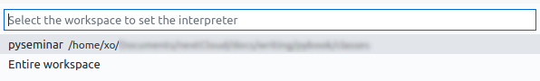
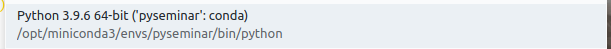

We will be using Python 3.11 for the seminar, with a set of dependencies, including Numpy, Pandas, Jupyter Lab, etc.

1. You could create such an environment named `pyclass` as follows:

   ```sh
   # conda create -n pyclass python=3.11 numpy matplotlib pandas jupyterlab
   ```

   But to make things easier here, we provide you with a file to describe the whole environment, called `environment.yml`, so just type the following command:

   ```sh
   mamba env create -f environment.yml
   ```

   You will be able to install any missing packages in your environment later, for example:

   ```sh
   conda install networkx  # slow
   mamba install networkx  # fast
   ```

   <div class="alert alert-warning">
   <b>Warning</b> &nbsp;&nbsp; If you don't have your computer with you, an environment has been prepared for you on school's computers. Ask assistants about it.
   </div>

2. Now, **every time** you want to run any Python script or Jupyter Lab, you should start by activating the environment as explained in the output you get when you create an environment.

   

   ```text
   # To activate this environment, use
   #
   #     $ conda activate pyclass
   #
   # To deactivate an active environment, use
   #
   #     $ conda deactivate
   ```

3. **One more thing**: set up your environment in your Visual Studio Code workspace.

   

   - double click on `pyclass.code-workspace` in the folder you [cloned from GitHub](setup). If your system seems confused, open Visual Studio Code first, then `File > Open Workspace...` ;
   - open any Python file in your environment;
   - select the Python version corresponding to the `pyclass` environment.

     - Click on the Python version:  
       

     - Here, both options are ok, but we recommend "Entire workspace":  
       

     - Pick the proper Python version:  
       

Now you should be ready to proceed!

[↑ Home](.) \| [Next >>](requirement)
