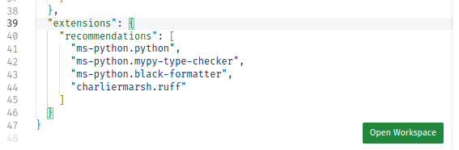

## Setting up your environment

You will need to set up **by yourself** the following pieces:

- [Visual Studio Code](https://code.visualstudio.com/). Open the `pyclass.code-workspace` file and click on the "Open Workspace" button.

  

- an Anaconda distribution, from the [following link](https://www.anaconda.com/products/individual). In case the question arises, it is very likely that the best suited version for your needs is the 64 bits one. Anaconda is more than a Python distribution: it also provides additional dependencies you may need;

- understand that you will need a terminal for cloning learning materials, installing dependencies and more. You are required to not run the Anaconda navigator. **(⇐ Please read again)**.

  - MacOS and Linux users should be familiar with their usual terminal application;
  - MacOS users will probably need to install common tools and dependencies with [brew](https://brew.sh/);
  - Windows users should find out how to run the **Anaconda prompt**.

  You are expected to be familiar with the most basic shell commands to list a directory, create and move files, change permissions, etc.

  Please set up the following settings:

  ```sh
  conda config --add channels conda-forge
  ```

- the `git` (or `git.exe` for Windows users) program, for version control. Using Git falls out of scope of this seminar, but you are **strongly encouraged** to become proficient with it. You may find resources on [GitHub Learning Lab](https://lab.github.com/), e.g. the following course for [first-timers](https://lab.github.com/lmachens/git-and-github-first-timers).

  Try running `git --version`. If necessary, install `git`:

  | Operating system | Installation command   |
  | ---------------- | ---------------------- |
  | Windows          | `conda install git`    |
  | MacOS            | `brew install git`     |
  | Linux (Ubuntu)   | `sudo apt install git` |

- clone the resources for the seminar:

  ```sh
  git clone https://github.com/xoolive/pyclass
  ```

  You may move the folder at any time if you prefer to keep things sorted differently on your computer.

  Before each session, it may be necessary to update the repository and get additional resources with fixes if errors were encountered in previous sessions. You should add the following options in order to avoid merging conflicts:

  ```sh
  git pull --rebase --autostash
  ```

[↑ Home](.) \| [Next >>](dependencies)
