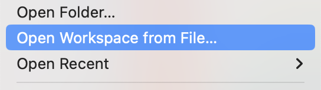
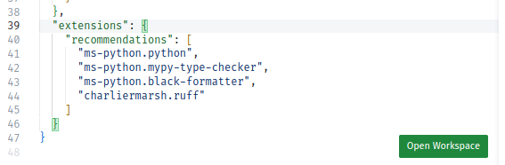
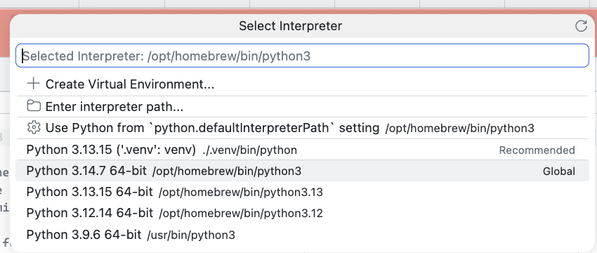
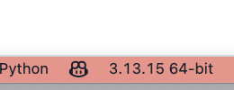

## Setting up your environment

<div class="alert alert-danger">
Please follow <b>every single step</b> below.<br/> If you miss a step, things will only work partially.
</div>

You will need to set up **by yourself** the following pieces:

- Download and install [Visual Studio Code](https://code.visualstudio.com/).  
  If you already have Visual Studio Code, install the latest version.

- Install [`uv`](https://docs.astral.sh/uv/getting-started/installation/) to manage the Python environment. Follow the installation instructions for your operating system.

- understand that you will need a terminal for cloning learning materials, installing dependencies and more.
  - MacOS and Linux users should be familiar with their usual terminal application;
  - MacOS users will probably need to install common tools and dependencies with [brew](https://brew.sh/);
  - Windows users should use **PowerShell**. The course commands (`uv`, Git commands) also work in Command Prompt (`cmd.exe`), but the `uv` installation instructions use PowerShell. In Visual Studio Code, choose **Terminal > New Terminal** and select the PowerShell profile if needed.

  You are expected to be familiar with the most basic shell commands to list a directory, create and move files, change permissions, etc.

- the `git` (or `git.exe` for Windows users) program, for version control.  
  Using Git falls out of scope of this seminar, but you are **strongly encouraged** to become proficient with it.  
  You may find resources on [GitHub Learning Lab](https://lab.github.com/), e.g. the following course for [first-timers](https://lab.github.com/lmachens/git-and-github-first-timers).

  Try running `git --version`. If necessary, follow the [Git installation instructions](https://git-scm.com/downloads) for your operating system.

- clone the resources for the seminar:

  ```sh
  git clone https://github.com/xoolive/pyclass
  ```

  You may move the folder at any time if you prefer to keep things sorted differently on your computer.

  Before each session, it may be necessary to update the repository and get additional resources with fixes if errors were encountered in previous sessions. You should add the following options in order to avoid merging conflicts:

  ```sh
  git pull --rebase --autostash
  ```

- With Visual Studio Code, open the `pyclass.code-workspace` file:



- If you opened the file instead of the workspace, click here:



- Accept the suggestions to install the recommended extensions and update Visual Studio Code.

- Create the course environment. Open a terminal (Terminal > New Terminal), then run:

  ```sh
  uv sync --locked
  ```

  This creates the `.venv` directory with the Python version and packages required for the course.

- Open a Python file, e.g. `python/numpy_demo.py`.

- Select the `.venv` interpreter. It should be marked **Recommended** in the interpreter picker:

  

  If it does not appear, run **Python: Select Interpreter** again and refresh the interpreter list.

- Confirm that the status bar shows the selected Python version:



- Confirm that you have the same red colour on your Visual Studio Code on your side.

[↑ Home](.) \| [Next >>](dependencies)
