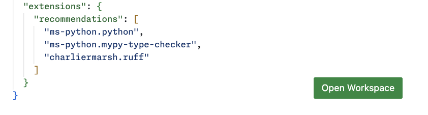

## Setting up your environment

You will need to set up **by yourself** the following pieces:

- [Visual Studio Code](https://code.visualstudio.com/). Open the `pyclass.code-workspace` file and click on the "Open Workspace" button.

  

- the `pixi` tool: you will get installation instructions [here](https://pixi.sh/latest/). For Windows, follow the "PowerShell" instructions (look for a PowerShell on your system, it's there I promise.)  
  For those who already know a little, `pixi` is a minimal tool providing environments similar to Anaconda, but we will not use Anaconda;

- understand that you will need a terminal for cloning learning materials, installing dependencies and more.

  - MacOS and Linux users should be familiar with their usual terminal application;
  - MacOS users will probably need to install common tools and dependencies with [brew](https://brew.sh/);
  - Windows users should find out how to run their PowerShell.

  You are expected to be familiar with the most basic shell commands to list a directory, create and move files, change permissions, etc.

- the `git` (or `git.exe` for Windows users) program, for version control. Using Git falls out of scope of this seminar, but you are **strongly encouraged** to become proficient with it. You may find resources on [GitHub Learning Lab](https://lab.github.com/), e.g. the following course for [first-timers](https://lab.github.com/lmachens/git-and-github-first-timers).

  Try running `git --version`. If necessary, install `git`:

  | Operating system  | Installation command      |
  | ----------------- | ------------------------- |
  | Linux (Ubuntu)    | `sudo apt install git`    |
  | MacOS (preferred) | `brew install git`        |
  | Windows or MacOS  | `pixi global install git` |

- clone the resources for the seminar:

  ```sh
  git clone https://github.com/xoolive/pyclass
  ```

  You may move the folder at any time if you prefer to keep things sorted differently on your computer.

  Before each session, it may be necessary to update the repository and get additional resources with fixes if errors were encountered in previous sessions. You should add the following options in order to avoid merging conflicts:

  ```sh
  git pull --rebase --autostash
  ```

<div class="alert alert-warning">
<b>Last step</b> In order to create your environment, you have to run Python for the first time, using the command <code>pixi run python</code> (in the folder of your project)
</div>

[↑ Home](.) \| [Next >>](dependencies)
